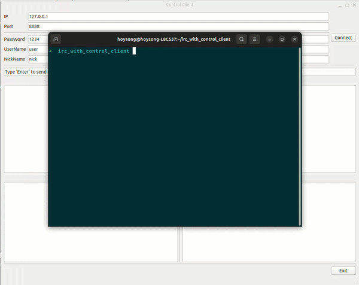

# ft_irc GUI 클라이언트

[English](./README.md) | [한국어](./README.ko.md)



## 프로젝트 소개

GUI Client for ft_irc는 **Qt Widgets**, 이벤트 기반 GUI 프로그래밍,
**QTcpSocket**을 이용한 TCP 통신을 학습하기 위해 만든 소규모 IRC
클라이언트입니다.

Qt Designer로 데스크톱 화면을 구성하고, Qt의 Signal/Slot 구조로 위젯
이벤트와 애플리케이션 로직을 연결하며, 서버와 주고받는 IRC 메시지를
화면에서 확인하는 데 중점을 두었습니다. 이 저장소는
[ft_irc 서버](https://github.com/hoysong/ft_irc)와 별도로 진행한 학습
프로젝트입니다.

## 학습 목표

- Qt Widgets와 Qt Designer를 이용한 데스크톱 UI 구성
- Signal/Slot을 이용한 이벤트 기반 프로그래밍 이해
- QTcpSocket의 비동기 소켓 이벤트 처리
- 화면과 네트워크 통신의 책임 분리
- CMake를 이용한 Qt 애플리케이션 빌드

## 주요 기능

- IP 주소와 포트를 이용한 IRC 서버 접속
- GUI에서 서버 비밀번호, 사용자명, 닉네임 설정
- 연결 성공 시 `PASS`, `NICK`, `USER` 명령 자동 전송
- Enter 키를 이용한 Raw IRC 명령 전송
- 명령 전송 전 IRC 메시지 구분자인 `\r\n` 자동 추가
- 연결 상태, 송신 메시지, 수신 메시지를 분리하여 표시
- 상태 화면과 경고 창을 통한 연결 오류 안내

## 구성

| 구성 요소 | 역할 |
| --- | --- |
| `MainWindow` | 사용자 입력을 읽고 화면을 갱신하며 위젯 이벤트와 애플리케이션 동작을 연결합니다. |
| `IRCGuiControlClient` | QTcpSocket 연결을 관리하고 연결, 메시지, 오류 이벤트를 Signal로 전달합니다. |
| `mainwindow.ui` | Qt Designer로 작성한 Qt Widgets 화면을 정의합니다. |

## 기술 스택

- C++17
- Qt 5 또는 Qt 6
- Qt Widgets
- Qt Network / QTcpSocket
- Qt Designer
- CMake

## 요구 사항

- CMake 3.5 이상
- C++17을 지원하는 컴파일러
- Widgets, Network, LinguistTools 구성 요소를 포함한 Qt 5 또는 Qt 6

## 빌드 및 실행

```bash
git clone https://github.com/hoysong/GUI-Client-for-ft_irc.git
cd GUI-Client-for-ft_irc
cmake -S . -B build
cmake --build build
./build/gui_control_client
```

멀티 구성 생성기나 Qt Creator를 사용하면 실행 파일의 위치가 달라질 수
있습니다.

## 사용 방법

1. [ft_irc](https://github.com/hoysong/ft_irc)와 같은 IRC 서버를 실행합니다.
2. 서버 IP, 포트, 비밀번호, 사용자명과 닉네임을 입력합니다.
3. **Connect**를 누르면 클라이언트가 등록 명령을 자동으로 전송합니다.
4. 전송할 Raw IRC 명령을 입력하고 Enter 키를 누릅니다.
5. 상태, 송신 메시지, 수신 메시지 영역에서 통신 내용을 확인합니다.

명령 입력 예시:

```text
JOIN #test
PRIVMSG #test :Hello from Qt
PART #test
QUIT :Goodbye
```

## 구현 범위

이 프로젝트는 Qt Widgets와 소켓 이벤트 처리를 학습하는 데 초점을 맞춘
프로젝트입니다. 완전한 IRC 클라이언트가 제공하는 채널 탭, 사용자 목록,
파싱된 채팅 화면 대신 Raw IRC 명령과 서버 응답을 보여줍니다.
